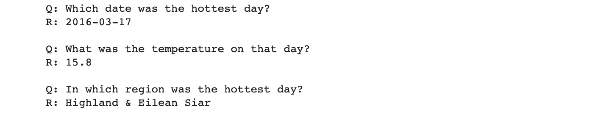
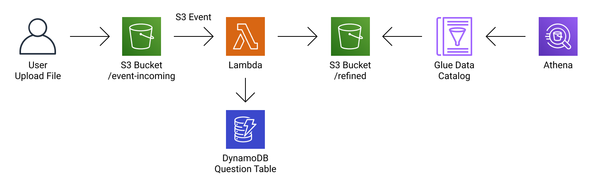
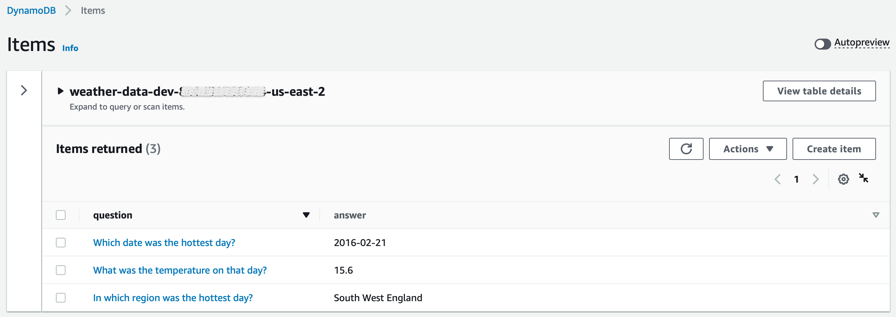
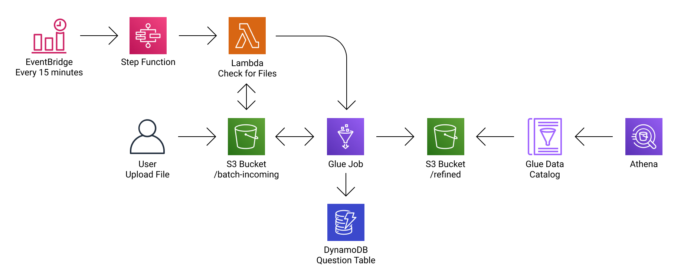
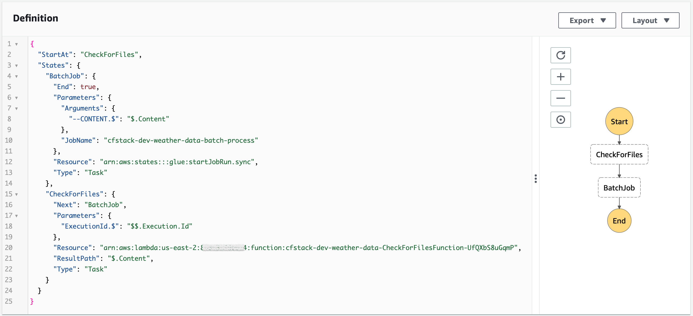
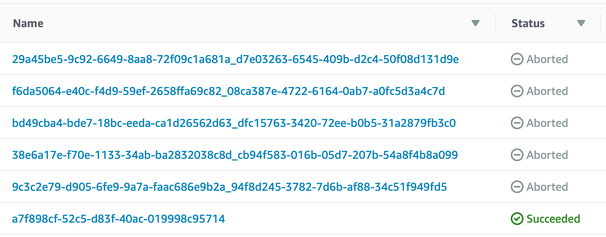
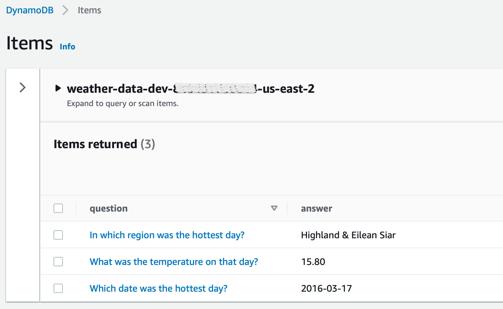
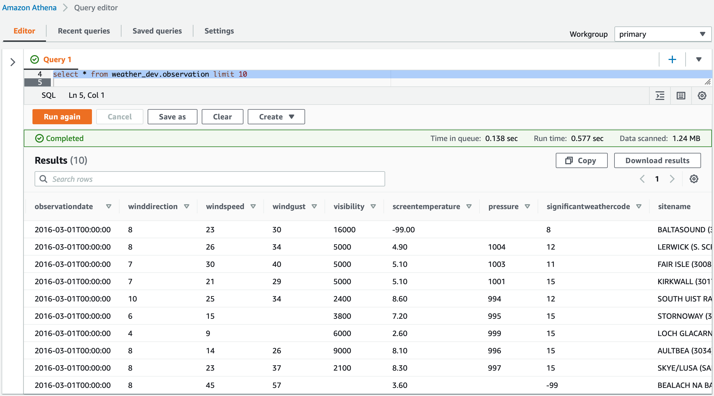

# Weather Data

This project aims to answer some questions about weather data from csv files, using Python and Data Engineering.

> This project was made with care and dedication in a couple of days. Any questions or improvements send me a problem, I'll be happy to talk to you 😀! Thank you and enjoy 🖤

There are many ways to get the answers, but here is the three ways chosen for this repository:

1. [Using Jupyter Notebook](#1-using-jupyter-notebook)

2. [Event-driven AWS Solution](#2-event-driven-aws-solution)

3. [Batch AWS Solution](#3-batch-aws-solution)

The questions are:

- Which date was the hottest day?

- What was the temperature on that day?

- In which region was the hottest day?

The csv files used for test are in [./test-data](test-data) folder.

For AWS Solutions, the answers can be seen in the [DynamoDB Table](#dynamodb-table).
Check the [AWS Deployment](#aws-deployment) instructions for deploy or destroy on your own AWS Account.

___

## 1. Using Jupyter Notebook

Check the script here: [./notebook/weather-with-pandas.ipynb](notebook/weather-with-pandas.ipynb).

This script use Python 3 and Pandas library to:

a. Read csv files and Union dataframes:
```python
df1 = pd.read_csv('filename1.csv')
df2 = pd.read_csv('filename2.csv')
df = df1.append(df2)
```

b. Convert csv to parquet:
```python
df.to_parquet('filename.parquet')
df = pd.read_parquet('filename.parquet')
```

c. Get the answers:
```python
# What was the temperature on that day?
df['ScreenTemperature'].max()
# Which date was the hottest day?
df[ df['ScreenTemperature'] == df['ScreenTemperature'].max() ]['ObservationDate']
# In which region was the hottest day?
df[ df['ScreenTemperature'] == df['ScreenTemperature'].max() ]['Region']
```



Please, check the video of execution here: [https://youtu.be/8iB7AEuzv7s](https://youtu.be/8iB7AEuzv7s)

___

## 2. Event-driven AWS Solution

Check the script here: [./aws-event-driven/lambda_function.py](aws-event-driven/lambda_function.py).



This solution uses the S3 Bucket Event Triggering Mechanism to invoke a Lambda that:

a. Validate if the filename ends with '.csv':
```python
key[-4:] != '.csv'
```

b. Validate if the file size is up to 10.49 MB (if larger, use [Batch Process](#3-batch-aws-solution)):
```python
size >= 11000000 # in bytes
```

This validation if only for example purposes, the Lambda MemorySize is set to 256.

c. Load CSV file using [AWS Data Wrangler](https://github.com/awslabs/aws-data-wrangler):
```python
df = wr.s3.read_csv('s3://bucket/key')
```

d. Check expected columns:
```python
df.columns.to_list() != ['ForecastSiteCode','ObservationTime','ObservationDate','WindDirection','WindSpeed','WindGust','Visibility','ScreenTemperature','Pressure','SignificantWeatherCode','SiteName','Latitude','Longitude','Region','Country']
```

e. Write (in S3) and Catalog (in Glue Data Catalog) Parquet:
```python
wr.s3.to_parquet(
    df=df,
    path='s3://bucket/refined/',
    dataset=True,
    mode='append',
    database='weather_prd',
    table='observation'
)
```

f. Calculate the highest temperature, compares with the previous answer if exists, and save in the [DynamoDB Table](#dynamodb-table):
```python
df['screen_temperature'].max() > float(boto3.client('dynamodb').get_item(
        TableName='question-table',
        Key={'question':{'S':'What was the temperature on that day?'}},
        ConsistentRead=True
    )['Item']['answer']['S']))
```

When executes this solution first using [./test-data](test-data), only the file `weather.20160201.csv` is processed.
The file `weather.20160301.csv` is to larger (in this example) to proccess with Lambda, and the awnsers will be:



PS: To demonstrate and track processing, the file is moved from the `event-incoming` folder to the `event-in-progress` folder. After writing the parquet, the file is moved to the `event-processed` folder. In case of error, the file is moved to the `event-error` folder along with a `.log` file with the error message.

PS1: The script creates the database, if not exists:
```python
wr.catalog.create_database('weather_prd', exist_ok=True)
```

___

## 3. Batch AWS Solution

Check the script here: [./aws-batch/glue_script.py](aws-batch/glue_script.py).



This batch process is scheduled each 15 minutes using EventBridge, that triggers the Step Function's state machine:



In Step Function, the first step is a simple Lambda that check if exists file to process. The next step is to start the Glue Job, passing the bucket and the list of files to be processed as parameter and do:

a. Load multiple CSV files into Spark DataFrame:
```python
df = None
for key in keys:
    df_read = spark.read.csv(f's3:://bucket/{key}')
    df = df_read if df == None else df.unionAll(df_read)
```

b. Write (in S3) and Catalog (in Glue Data Catalog) Parquet:
```python
df.write \
    .format('parquet') \
    .option('path','s3://bucket/refined/') \
    .mode('append') \
    .saveAsTable('weather_prd.observation')
```

c. Calculate the highest temperature, compares with the previous answer if exists, and save in the [DynamoDB Table](#dynamodb-table):
```python
df.select(col('ScreenTemperature')).max().collect()[0] > float(boto3.client('dynamodb').get_item(
        TableName='question-table',
        Key={'question':{'S':'What was the temperature on that day?'}},
        ConsistentRead=True
    )['Item']['answer']['S']))
```

PS: If there aren't CSV files to process, the `Check for Files` Lambda Function aborts the Step Function Execution:



PS1: To demonstrate and track processing, the file is moved from the `batch-incoming` folder to the `batch-in-progress` folder. After writing the parquet, the file is moved to the `batch-processed` folder. In case of error, the file is moved to the `batch-error` folder along with a `.log` file with the error message.

PS2: The script creates the database, if not exists:
```python
spark.sql('CREATE DATABASE IF NOT EXISTS weather_prd')
```

___

## DynamoDB Table

Both AWS Solution write the answers in same DynamoDB Table.

This is the final result, after runs the Event-driven and Batch process:



This DynamoDB Table can be used in RestAPI to delivery a fast data to a application, for example.

___

## Query Data using Athena and Glue Data Catalog

Weather data is also available for query through Athena in adjunct with the Glue Data Catalog:



___

## AWS Deployment

The AWS Solutions was made as IaC (Infrastructure as Code).

### Deploy

Follow the steps below for deployment:

1. Make sure have a [AWS Account](https://aws.amazon.com).

2. Install and configure the [AWS CLI](https://aws.amazon.com/cli/).

3. Create a S3 Bucket used for package CloudFormation template:

```bash
% aws s3 mb s3://bucket-name
```

4. Check the [CloudFormation template](aws-cfstack-template.yaml) (no action needed here).

5. Execute the [./aws-cfstack-deploy.sh](aws-cfstack-deploy.sh) shell script, passing the environment (like dev or prd) and bucket-name (created at step 3):

```bash
% bash aws-cfstack-deploy.sh env bucket-name
```

### Destroy

Follow the steps below for cleaning:

1. Drop tables and database by Athena, using the environment passing on deploy step 5:

```sql
drop table weather_env.observation
drop database weather_env
```

2. Empty both buckets created at deploy, step 3 and step 5.

3. Clear all items of DynamoDB Table created at deploy step 5.

4. Delete CloudFormation Stack created at deploy step 5.
