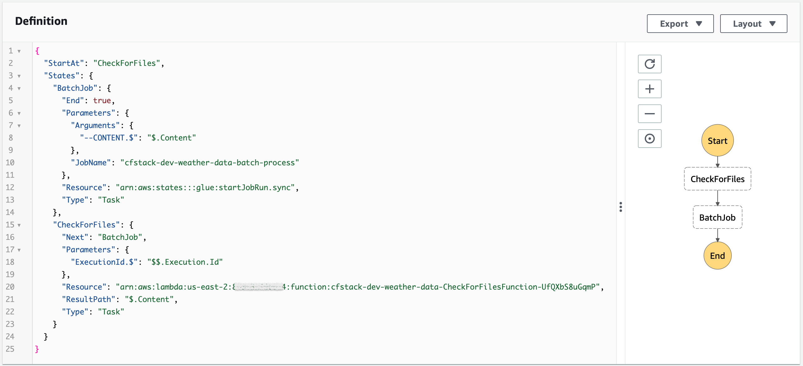

# Weather Data

This project aims to answer some questions about weather data from csv files, using Python and Data Engineering.

There are three ways to get to the answers in this repository:

1. [Using Jupyter Notebook](#1-using-jupyter-notebook)

2. [Event-driven Solution in AWS](#2-event-driven-solution-in-aws)

3. [Batch Solution in AWS](#3-batch-solution-in-aws)

The questions to answer are:

- Which date was the hottest day?

- What was the temperature on that day?

- In which region was the hottest day?

The csv files used for test are in [./test-data](test-data) folder.

___

## 1. Using Jupyter Notebook

Check the notebook with the answers here: [./notebook/weather-with-pandas.ipynb](notebook/weather-with-pandas.ipynb).

This script use Python 3 and Pandas library to:

a. Read csv files and Union dataframes:
```python
df1 = pd.read_csv('filename1.csv')
df2 = pd.read_csv('filename2.csv')
df = df1.append(df2)
```

b. Convert csv to parquet:
```python
df.to_parquet('filename.parquet')
df = pd.read_parquet('filename.parquet')
```

c. Get the answers:
```python
# What was the temperature on that day?
df['ScreenTemperature'].max()
# Which date was the hottest day?
df[ df['ScreenTemperature'] == df['ScreenTemperature'].max() ]['ObservationDate']
# In which region was the hottest day?
df[ df['ScreenTemperature'] == df['ScreenTemperature'].max() ]['Region']
```

___

## 2. Event-driven Solution in AWS

Check the script here: [./aws-event-driven/lambda_function.py](aws-event-driven/lambda_function.py).


This solution uses the S3 Bucket Event Triggering Mechanism to invoke a Lambda that:

a. Validate if the filename ends with '.csv':
```python
key[-4:] != '.csv'
```

b. Validate if the file size is up to 10.49 MB (if larger, use [Batch Process](#3-batch-solution-in-aws)):
```python
size >= 11000000 # in bytes
```

Only for example purposes, the Lambda MemorySize is set to 256.

c. Load CSV file using [AWS Data Wrangler](https://github.com/awslabs/aws-data-wrangler):
```python
df = wr.s3.read_csv('s3://bucket/key')
```

d. Check expected columns:
```python
df.columns.to_list() != ['ForecastSiteCode','ObservationTime','ObservationDate','WindDirection','WindSpeed','WindGust','Visibility','ScreenTemperature','Pressure','SignificantWeatherCode','SiteName','Latitude','Longitude','Region','Country']
```

e. Write (in S3) and Catalog (in Glue Data Catalog) Parquet:
```python
wr.s3.to_parquet(
    df=df,
    path='s3://bucket/refined/',
    dataset=True,
    mode='append',
    database='weather_prd',
    table='observation'
)
```

f. Calculate the highest temperature, compares with the previous answer if exists, and save in the [Question DynamoDB Table](#answers-in-question-dynamodb-table):
```python
df['screen_temperature'].max() > float(boto3.client('dynamodb').get_item(
        TableName='question-table',
        Key={'question':{'S':'What was the temperature on that day?'}},
        ConsistentRead=True
    )['Item']['answer']['S']))
```

PS: To demonstrate and track processing, the file is moved from the `event-incoming` folder to the `event-in-progress` folder. After writing the parquet, the file is moved to the `event-processed` folder. In case of error, the file is moved to the `event-error` folder along with a `.log` file with the error message.

PS1: The script creates the database, if not exists:
```python
wr.catalog.create_database('weather_prd', exist_ok=True)
```

___

## 3. Batch Solution in AWS

Check the script here: [./aws-batch/glue-script.py](aws-batch/glue-script.py).


This batch process is scheduled each 15 minutes using EventBridge, that triggers the Step Function's state machine.



In Step Function, the first step is a simple Lambda that check if exists file to process. The next step is to start the Glue Job, passing the bucket and the list of files to be processed as parameter and do:

a. Load multiple CSV files into Spark DataFrame:
```python
df = None
for key in keys:
    df_read = spark.read.csv(f's3:://bucket/{key}')
    df = df_read if df == None else df.unionAll(df_read)
```

b. Write (in S3) and Catalog (in Glue Data Catalog) Parquet:
```python
df.write \
    .format('parquet') \
    .option('path','s3://bucket/refined/') \
    .mode('append') \
    .saveAsTable('weather_prd.observation')
```

c. Calculate the highest temperature, compares with the previous answer if exists, and save in the [Question DynamoDB Table](#answers-in-question-dynamodb-table):
```python
df.select(col('ScreenTemperature')).max().collect()[0] > float(boto3.client('dynamodb').get_item(
        TableName='question-table',
        Key={'question':{'S':'What was the temperature on that day?'}},
        ConsistentRead=True
    )['Item']['answer']['S']))
```

PS: To demonstrate and track processing, the file is moved from the `batch-incoming` folder to the `batch-in-progress` folder. After writing the parquet, the file is moved to the `batch-processed` folder. In case of error, the file is moved to the `batch-error` folder along with a `.log` file with the error message.

PS1: The script creates the database, if not exists:
```python
spark.sql('CREATE DATABASE IF NOT EXISTS weather_prd')
```

___

## Answers in Question DynamoDB Table

___

## Query Data using Athena and Glue Data Catalog


